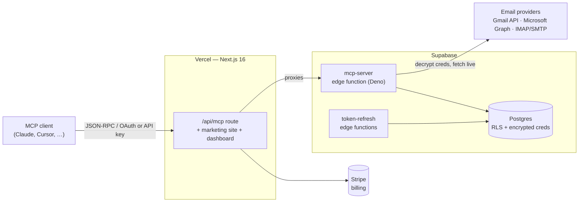

# MCPEmails

**Give your AI agent an inbox.** A hosted [Model Context Protocol](https://modelcontextprotocol.io) server that lets Claude, Cursor, or any MCP‑compatible client read, search, send, organize, and schedule email through your existing mailboxes — without ever storing your mail.

[](https://glama.ai/mcp/servers/Albretsen/MCPEmails)
[](https://www.npmjs.com/package/mcpemails)
[](https://registry.modelcontextprotocol.io/v0/servers?search=mcpemails)
[](LICENSE)

> Connect a mailbox once, paste one URL into your agent, and it can work your inbox live. Email is fetched on demand and never retained; credentials are encrypted at rest and decrypted only at call time inside an isolated edge function.

🔗 **[mcpemails.com](https://mcpemails.com)** · 📚 **[Docs](https://mcpemails.com/docs)** · 💳 **[Pricing](https://mcpemails.com/pricing)**

---

## Contents

- [How it works](#how-it-works)
- [Quick start (connecting an agent)](#quick-start-connecting-an-agent)
- [Capabilities](#capabilities)
- [Tools](#tools)
- [OAuth scopes](#oauth-scopes)
- [Supported providers](#supported-providers)
- [Pricing](#pricing)
- [Architecture](#architecture)
- [Repository layout](#repository-layout)
- [Local development](#local-development)
- [Environment variables](#environment-variables)
- [Database & migrations](#database--migrations)
- [Deployment](#deployment)
- [Self-hosting](#self-hosting)
- [Internationalization](#internationalization)
- [Security model](#security-model)

---

## How it works

1. **Connect a mailbox.** Sign in at [mcpemails.com](https://mcpemails.com) and connect Outlook / Microsoft 365 (Sign in with Microsoft, over Microsoft Graph), Gmail (a Google app password over IMAP by default, or Sign in with Google), or any IMAP/SMTP account (app password). Credentials are encrypted with AES‑256‑GCM before they touch the database.
2. **Get access.** OAuth‑capable clients (claude.ai, Claude Desktop, Cursor) connect in one click via OAuth 2.0 + PKCE. Everything else uses a scoped API key (`mcpe_…`).
3. **Point your client at the server.** The MCP endpoint is a single URL:
   ```
   https://mcpemails.com/api/mcp
   ```
4. **Your agent works the inbox.** It calls tools like `inbox_list`, `email_read` (`action: "search"`), `email_compose` (`action: "send"`), and `schedule` (`action: "create"`). Each request fetches live from your provider — nothing is mirrored or cached server‑side.

Permissions are scoped per key, so you can hand an agent `read:email` only, or grant it send and folder management without ever exposing delete.

## Quick start (connecting an agent)

**Claude Desktop / Cursor (OAuth):** add a remote MCP server pointing at `https://mcpemails.com/api/mcp` and approve the consent screen. Pick the scopes the agent should have.

**API key (any MCP client):** create a key in the dashboard, choose its scopes and (optionally) restrict it to specific inboxes, then send it as a bearer token:

```jsonc
// Example MCP client config
{
  "mcpServers": {
    "mcpemails": {
      "url": "https://mcpemails.com/api/mcp",
      "headers": { "Authorization": "Bearer mcpe_your_key_here" }
    }
  }
}
```

The protocol is JSON‑RPC 2.0 over HTTP (MCP `2025-06-18`, Streamable transport). Start every session with `inbox_list` — it returns the inboxes the key can reach, their per‑provider capabilities, and a versioned compatibility profile. The profile marks normalized operations as `exact`, `different`, or `unavailable`, so agents can preserve provider differences rather than silently weakening a request.

### Setup guides

Copy‑paste instructions per client, including where each one keeps its config file: **[mcpemails.com/docs/clients](https://mcpemails.com/docs/clients)**.

[Claude](https://mcpemails.com/docs/claude) · [Claude Code](https://mcpemails.com/docs/claude-code) · [ChatGPT](https://mcpemails.com/docs/chatgpt) · [Cursor](https://mcpemails.com/docs/cursor) · [VS Code](https://mcpemails.com/docs/vscode) · [Cline](https://mcpemails.com/docs/cline) · [Windsurf](https://mcpemails.com/docs/windsurf) · [Gemini CLI](https://mcpemails.com/docs/gemini-cli) · [Zed](https://mcpemails.com/docs/zed) · [JetBrains](https://mcpemails.com/docs/jetbrains) · [Raycast](https://mcpemails.com/docs/raycast) · [Warp](https://mcpemails.com/docs/warp) · [curl](https://mcpemails.com/docs/curl)

## Capabilities

- **Live, never stored** — email is read straight from your provider on each call; no message bodies are persisted.
- **Multi‑provider** — Outlook / Microsoft 365 via Microsoft Graph (Sign in with Microsoft), Gmail via a Google app password or Sign in with Google, plus any IMAP/SMTP mailbox (Fastmail, iCloud, Yahoo, Zoho, Yandex, self‑hosted…) via app password.
- **No relay** — outbound mail is sent through *your* provider's SMTP/API, from your real address.
- **Granular scopes** — eight permission scopes, grantable independently per API key and per inbox.
- **Batch & search‑and‑act** — read, move, delete, or flag up to hundreds of messages in one call, including "search then move/delete" combinators.
- **Drafts & scheduling** — compose drafts and queue messages for future send (server‑side dispatch).
- **Provider‑agnostic search** — Gmail syntax, Microsoft Graph KQL and IMAP `SEARCH` are normalized behind one `email_read` (`action: "search"`) interface.
- **Team‑ready**: workspaces, members, roles, SSO, and an audit log on the Team plan.

## Tools

17 tools you call directly. Most are resource-oriented and take an `action` argument that selects the specific operation (and, for actions that need different privileges, the required scope):

- `inbox_list` - Lists the inboxes the key can reach, with each one's provider capabilities.
- `email_read` - Lists, reads and searches messages, in batches, plus attachments, extracted attachment text and the original `.eml`.
- `email_organize` - Moves, copies, flags and archives messages you name by id, singly or in batches.
- `email_search_and_move` - Moves every message matching a search into a folder. Its own tool, and the destructive one, because a wrong filter relocates a whole inbox.
- `email_delete` - Trashes or permanently deletes messages, singly, in batches, or by search.
- `email_compose` - Sends, replies and forwards through your own provider, from your real address.
- `folder_list` - Lists folders (labels on Gmail) with their provider-native IDs and message counts. Read-only.
- `folder` - Creates, renames and deletes folders (labels on Gmail).
- `draft_list` - Lists the drafts saved in the inbox, with their draft ids. Read-only.
- `draft` - Creates, updates, sends and deletes drafts, including provider-native replies.
- `schedule_list` - Lists what is queued for future delivery. Read-only.
- `schedule` - Queues a message for future delivery, and cancels one that is queued.
- `signature_get` - Reads the signature and sender name configured for an inbox. Read-only.
- `signature_set` - Sets the signature appended to outbound mail, and the sender name.
- `automation_read` - Lists triage rules, reads one, shows run history, and dry-runs a filter. Read-only.
- `automation` - Creates, updates, enables, disables and deletes unattended triage rules, with no model in the loop.
- `contact_search` - Looks up contacts by scanning recent mail live, with no stored address book.

| Tool | Actions | Scope(s) |
| --- | --- | --- |
| `inbox_list` | *(single action)* | `read:email` |
| `email_read` | `list`, `read`, `read_batch`, `search`, `attachment`, `extract`, `original` | `read:email` (`search` also accepts `search:email`) |
| `email_organize` | `move`, `move_batch`, `copy`, `copy_batch`, `flag`, `archive` | `manage:folders` |
| `email_search_and_move` | *(single action)* | `manage:folders` |
| `email_delete` | `delete`, `delete_batch`, `search_and_delete` | `delete:email` |
| `email_compose` | `send`, `reply`, `forward` | `send:email` |
| `folder_list` | *(single action)* | `read:email` |
| `folder` | `create`, `rename`, `delete` | `manage:folders` |
| `draft_list` | *(single action)* | `manage:drafts` |
| `draft` | `create`, `reply`, `update`, `send`, `delete` | `manage:drafts` (create/reply/update/delete), `read:email` (reply also), `send:email` (send) |
| `schedule_list` | *(single action)* | `schedule:email` |
| `schedule` | `create`, `cancel` | `schedule:email` |
| `signature_get` | *(single action)* | `read:email` |
| `signature_set` | *(single action)* | `send:email` |
| `automation_read` | `list`, `get`, `runs`, `preview` | `manage:automations` |
| `automation` | `create`, `update`, `enable`, `disable`, `delete` | `manage:automations` |
| `contact_search` | *(single action)* | `manage:contacts` (also accepts `read:email`) |

A full-scope key sees **22** tools in `tools/list`: the 16 above plus six app-only tools (`approval_review`, `approval_decide`, `approval_update`, `approval_schedule`, `bulk_execute`, `bulk_cancel`). Those carry `_meta.ui.visibility: ["app"]` and drive the review card an MCP client renders for a held send or a previewed bulk operation, rather than being composed by hand.

Notes:
- Tools accept either an explicit `inbox_id` (UUID) or an `inbox` email address; single‑inbox keys auto‑resolve the target.
- Batch actions cap at 50 (`email_read`'s `read_batch`) to 500 (move/delete/flag) messages per call.
- For a targeted mutation, first use `email_read` with `action: "search"`, then pass the returned `message_id` or `message_ids` to `email_organize` or `email_delete`. Search fields are accepted only by `email_search_and_move` and `email_delete`'s `search_and_delete` action.
- `contact_search` scans recent mail live, so there is no stored address book.
- `email_read`'s `original` action returns one complete provider-stored MIME message as a portable `.eml` file (up to 25 MB). It is read-only and never marks the message as read.
- `draft`'s `send` action requires `send:email`, not `manage:drafts`, so a key that can only manage drafts can't use them to bypass the send‑mail consent.
- `draft`'s `reply` action creates an unsent, provider-native reply in the source conversation. It needs both `manage:drafts` and `read:email`, and defaults to replying only to the sender.
- The read-only halves (`folder_list`, `draft_list`, `schedule_list`, `signature_get`, `automation_read`) were split out of their write tools on 2026-09-09, so a read-only key is never shown a write tool. The old combined shapes (`folder` `action: "list"`, `draft` `action: "list"`, `schedule` `action: "list"`, `signature` `action: "get"`/`"set"`, `automation` `action: "list"`/`"get"`/`"runs"`/`"preview"`) are still accepted on the wire for already-connected clients, but are no longer advertised.
- `automation` manages unattended scheduled triage rules: a stored search plus one fixed action, evaluated on a cadence with no model in the loop. There is no delete-mail action, a `forward` always waits for human approval, and `draft_reply` only ever writes a draft. See `docs/automations-trust-boundary.md`.
- `tools/list` only returns the tools your key (or OAuth token) is actually scoped for.

## OAuth scopes

| Scope | Grants |
| --- | --- |
| `read:email` | List inboxes & folders; list, read, and search messages; read an inbox's signature; look up contacts |
| `search:email` | Narrower alternative that grants only `email_read`'s `search` action |
| `send:email` | Send, reply and forward; set the signature and sender name; also required to send a draft |
| `manage:folders` | Create/rename/delete folders; move, copy, flag and archive messages |
| `delete:email` | Trash or permanently expunge messages |
| `manage:drafts` | Create, edit, and delete drafts (sending one also requires `send:email`) |
| `manage:contacts` | Live contact lookup from recent mail |
| `schedule:email` | Queue messages for future delivery |
| `manage:automations` | Create and manage unattended scheduled triage rules (no delete action; forwards stay approval-gated) |

## Supported providers

| Provider | Connect via | Read/Search | Send | Folders | Permanent delete | Drafts |
| --- | --- | --- | --- | --- | --- | --- |
| **Gmail / Google Workspace** | App password (IMAP/SMTP) by default, or OAuth 2.0 (Sign in with Google) | ✅ | ✅ | Labels | Trash only | ✅ |
| **Fastmail** | App password (IMAP/SMTP) | ✅ | ✅ | ✅ | ✅ | ✅ |
| **iCloud, Yahoo, AOL, GMX, Zoho, Yandex** | App password (IMAP/SMTP) | ✅ | ✅ | ✅ | ✅ | ✅ |
| **IONOS, STRATO, One.com, OVHcloud, Namecheap Private Email, Hostinger, Infomaniak, Hetzner** | Mailbox password (IMAP/SMTP) | ✅ | ✅ | ✅ | ✅ | ✅ |
| **cPanel, Plesk, SiteGround, Bluehost and other shared hosts** | Mailbox password (IMAP/SMTP) | ✅ | ✅ | ✅ | ✅ | ✅ |
| **Any other IMAP/SMTP mailbox** | App password or mailbox password | ✅ | ✅ | ✅ | ✅ | ✅ |

> Mail on your own domain at a web host connects like any IMAP mailbox, and one workspace can hold several of them (info@, sales@, support@). Per-host settings and known pitfalls for 100 providers are at [mcpemails.com/connect](https://mcpemails.com/connect).
| **Outlook / Microsoft 365** | OAuth 2.0 (Microsoft Graph) | ✅ | ✅ | ✅ (nested) | ✅ | ✅ |

> Outlook uses Microsoft Graph with "Sign in with Microsoft", not IMAP. Personal Microsoft accounts (outlook.com, hotmail.com, live.com, msn.com) connect directly. On work or school Microsoft 365 tenants, Microsoft's default consent policy stops employees approving mail permissions themselves, so an IT admin approves the app once for the organisation; the dashboard gives the user a shareable approval link to send them (`/auth/outlook/admin-consent`), and the admin needs no MCP Emails account. A Microsoft account with no Exchange Online mailbox is refused, with a pointer to IMAP. The label tools are Gmail-only (Outlook uses folders), except that an automation's label action applies an Outlook category; and Graph cannot combine a text search with the unread, attachment, flagged or date filters.

## Pricing

The value metric is **connected inboxes**. Free connects one mailbox, Personal connects up to three, Pro connects every mailbox you own, and Team adds people, roles, and a separate workspace per client. Annual billing saves about 20%.

| | **Free** | **Personal** | **Pro** | **Team** |
| --- | --- | --- | --- | --- |
| Price | $0 | $9/mo · $86.40/yr ($7.20/mo) | $15/mo · $144/yr ($12/mo) | $79/mo · $756/yr ($63/mo) |
| Connected inboxes | 1 | 3 | Unlimited | Unlimited |
| Email actions / month | 150 (first 7 days uncounted) | No monthly cap (fair use) | No monthly cap (fair use) | No monthly cap (fair use) |
| API keys | Unlimited | Unlimited | Unlimited | Unlimited |
| Members | 1 (owner only) | 1 (owner only) | 1 (owner only) | Unlimited, with roles |
| Fair‑use rate limit | 60 req/min | 120 req/min | 300 req/min | 1,000 req/min |
| Team roles & workspaces | No | No | No | ✅ |
| SSO (SAML/OIDC) + audit log | No | No | No | ✅ |
| Support | Community | Email | Email | Priority |

Per‑API‑key limits also apply (100 req/min · 1,000/hr · 10,000/day). Rate limits are retryable: they come back as JSON-RPC error `-32003` with `data.retry_after` in seconds.

Free workspaces get **150 email actions per calendar month (UTC)**. The first 7 days after signup are not counted, and `inbox_list` and the dashboard are never counted. When the allowance is reached, every other email action is refused until the 1st of the next month, unattended automations pause and resume automatically on the 1st, and the owner is emailed at 80% and at 100%. Personal, Pro and Team have no monthly cap, subject to fair use (their ceilings are abuse guards, not plan features, and are not printed anywhere). A refusal is not retryable and not a JSON-RPC error: it comes back as a normal tool result with `isError: true`, text that opens with the count and the reset date, and a `_meta["com.mcpemails/usage_limit"]` block that clears at `reset_at`.

Internal plan ids predate the names: `solo` is sold as **Pro** and `pro` is sold as **Team**. The newer `personal` id is the only one that matches its display name, **Personal**. Every user who existed before the 2026-08-19 repricing keeps unlimited inboxes for free, permanently, and every workspace created before the 2026-09-12 launch of the action allowance is an early member that is not metered against it. See [`apps/web/src/lib/stripe/plans.ts`](apps/web/src/lib/stripe/plans.ts).

## Architecture



- **`/api/mcp`** is a thin Next.js route handler that proxies to the Supabase edge function `mcp-server` — the real MCP implementation, where credentials are decrypted and provider calls are made.
- **The Postgres database** stores workspaces, members, inboxes (encrypted tokens/passwords), hashed API keys, OAuth clients, scheduled sends, and an activity log — all guarded by Row‑Level Security.
- **Cron edge functions** refresh Gmail/Outlook OAuth tokens before expiry.

**Stack:** Next.js 16 (App Router) · React 19 · next‑intl 4 · Supabase (Auth, Postgres, Edge Functions) · Stripe · Resend · TypeScript. Email parsing/sanitization via `mailparser`, `jsdom`, and `isomorphic-dompurify`.

## Repository layout

```
.
├── apps/
│   └── web/                     # Next.js 16 app (marketing, dashboard, /api/mcp proxy)
│       ├── app/                 # App Router routes ([locale], dashboard, api, auth)
│       ├── components/          # marketing/ + dashboard/ React components
│       ├── messages/            # next-intl translations (en, nb, es, fr, zh)
│       ├── src/lib/             # stripe/, supabase/, blog/, crypto helpers
│       └── proxy.ts             # middleware: i18n + Supabase session + CDN cache
├── supabase/
│   ├── functions/
│   │   ├── mcp-server/          # the MCP server (tools, auth, scopes)
│   │   ├── gmail-token-refresh/
│   │   └── outlook-token-refresh/
│   └── migrations/              # SQL migrations (schema + RLS)
└── package.json                 # npm workspaces (apps/*)
```

## Local development

**Prerequisites:** Node.js 20+, npm, and the [Supabase CLI](https://supabase.com/docs/guides/cli) (for migrations and edge functions).

```bash
# 1. Install (npm workspaces — run from the repo root)
npm install

# 2. Configure environment
cp .env.example apps/web/.env.local
#   then fill in the values (see below) and generate the two secrets:
openssl rand -hex 32   # ENCRYPTION_KEY
openssl rand -hex 32   # CSRF_SECRET

# 3. Run the web app (http://localhost:3000)
npm run dev

# 4. Production build
npm run build
```

> `next.config.js` validates required env vars at build/start and rejects weak `ENCRYPTION_KEY` values, so a misconfigured environment fails fast instead of at runtime.

## Environment variables

Copy [`.env.example`](.env.example) and fill in real values. Required in every environment:

| Variable | Purpose |
| --- | --- |
| `NEXT_PUBLIC_SUPABASE_URL` / `NEXT_PUBLIC_SUPABASE_ANON_KEY` | Supabase client (public) |
| `SUPABASE_SERVICE_ROLE_KEY` | Server‑side admin key (bypasses RLS) — **secret** |
| `NEXT_PUBLIC_APP_URL` | Canonical base URL; drives OAuth redirect URIs |
| `GOOGLE_SITE_VERIFICATION` *(optional)* | Google Search Console HTML-tag verification token; set only in production |
| `ENCRYPTION_KEY` | 64‑hex AES‑256‑GCM key for credentials at rest — **secret** |
| `CSRF_SECRET` | 64‑hex HMAC key for CSRF tokens (distinct from above) — **secret** |

Feature‑dependent:

| Variable(s) | Needed for |
| --- | --- |
| `GMAIL_CLIENT_ID` / `GMAIL_CLIENT_SECRET` | Gmail OAuth (`gmail.readonly`, `gmail.send`, `gmail.modify`) |
| `OUTLOOK_CLIENT_ID` / `OUTLOOK_CLIENT_SECRET` / `OUTLOOK_TENANT_ID` | Outlook OAuth (`Mail.ReadWrite`, `Mail.Send`, `offline_access`, `openid`, `profile`, `email`). `OUTLOOK_TENANT_ID` is optional and defaults to `common` |
| `NEXT_PUBLIC_OAUTH_VERIFICATION_PENDING` | Shows the unverified‑app warning until Google verification completes (the Microsoft publisher is already verified) |
| `STRIPE_SECRET_KEY` / `STRIPE_WEBHOOK_SECRET` / `NEXT_PUBLIC_STRIPE_PUBLISHABLE_KEY` | Billing |
| `STRIPE_PRICE_PERSONAL_MONTHLY` / `_YEARLY`, `STRIPE_PRICE_SOLO_MONTHLY` / `_YEARLY`, `STRIPE_PRICE_PRO_MONTHLY` / `_YEARLY` | Plan price IDs (`personal` = Personal, `solo` = Pro, `pro` = Team) |
| `STRIPE_WEBHOOK_PROXY_KEY` | Optional. Restricts `/api/stripe/webhook` to the delivery queue in front of it. Unset = no restriction. Set it only AFTER the queue is sending the key, or every delivery 401s and is dead‑lettered. |
| `STRIPE_WEBHOOK_TOLERANCE_SECONDS` | Optional. Stripe signature age limit, default 7 days. Wide because a queued replay carries its original signature; Stripe's own 300s default would reject every held retry. |

> Fastmail and other IMAP providers connect via app password and need no OAuth credentials.

> **Stripe webhooks are delivered through a queue.** Stripe posts to the Queuey ingress, which forwards to `/api/stripe/webhook`. Two settings on that queue are load‑bearing: the payload must be **raw passthrough** (the signature is over exact bytes), and a **mapped header** must forward `header:Stripe-Signature`. Without the mapped header every delivery fails with `Missing stripe-signature header.` Note that `STRIPE_WEBHOOK_SECRET` must be the signing secret of the Stripe endpoint pointed at the *ingress*, not of any older direct endpoint.

## Database & migrations

Schema and Row‑Level Security policies live in [`supabase/migrations/`](supabase/migrations/). Core tables: `workspaces`, `workspace_members`, `inboxes` (encrypted credentials, soft‑deleted), `api_keys` (hashed, scoped, inbox‑restricted), `oauth_clients`, `scheduled_sends`, `workspace_invites`, and a month‑partitioned `activity_log`.

```bash
# Apply migrations to the linked project
npx supabase db push

# Regenerate TypeScript types from the live schema
npm run gen:types
```

> The Supabase CLI is the source of truth for DB changes in this project.

### `apps/web/src/types/database.types.ts` is GENERATED

It is written in full by `npm run gen:types` (`supabase gen types typescript
--linked`), which reads the **live linked project**, not the migration files.
Do not hand-edit it: a hand-added column is silently dropped by the next
regeneration, and a hand-added column that never existed in the database
compiles clean and 500s in production. Regenerate it in the same change that
applies a migration, and commit the result.

Tables, views and RPC functions are all covered, and every Supabase client
declared in the `.ts`/`.tsx` of `apps/web` (which is the whole typechecked
program) is `SupabaseClient<Database>`, so `.from()`, `.select()`, `.insert()`
and `.rpc()` are type-checked against the real schema. If a table or column
looks missing, the fix is `npm run gen:types`, never a local `as any` on the
Supabase client. Casts that remain are for things the generator genuinely
cannot express: jsonb payload shapes, nullable function arguments, and one
helper that dispatches many RPCs through a single signature. Each of those
carries a comment saying so.

The `.ts`/`.tsx` qualifier is load-bearing. `apps/web/tsconfig.json` sets no
`checkJs` and its `include` is `**/*.ts` and `**/*.tsx`, so a `.js` file such as
`app/dashboard/[[...section]]/page.js` is outside the program entirely: its
JSDoc `@param` types are documentation and nothing verifies them. They are
written as `SchemaTypedClient` (a `@typedef` for
`SupabaseClient<Database>`) so the documentation at least agrees with what the
callers pass, but keeping it honest is a manual job.

**Never write a bare `SupabaseClient`.** With no type argument it resolves to
`SupabaseClient<any, "public", any>`, which is an `as any` that no grep for
`as any` will find: a function declared `db: SupabaseClient` gets no column
checking at all, and a nonexistent column in an `.insert()` compiles clean.
`SupabaseClient<any>` is the same hole spelled out loud, and so are
`SupabaseClient<any | Database>` and `SupabaseClient<Alias>` where the alias is
`any`. `apps/web/eslint.config.mjs` therefore does not hunt for `any`; it
requires `Database`, and `npm run lint` errors on any `SupabaseClient` type
reference that does not carry it, plus an un-parameterised
`createServerClient(...)` / `createBrowserClient(...)`.

Those are syntactic selectors (the repo runs no type-aware linting), so they
match on the spelling at the use site and three things could otherwise walk
straight past them: `import { SupabaseClient as SB }`, `import * as Supa` then
`Supa.SupabaseClient`, and `const mk = createServerClient; mk(...)`. No selector
can see through any of those, so the config closes them one level up instead:
renaming the `SupabaseClient` import and namespace-importing `@supabase/ssr` or
`@supabase/supabase-js` are themselves errors, and `no-restricted-imports`
keeps `createClient` / `createServerClient` / `createBrowserClient` out of every
file except the wrappers in `src/lib/supabase/`, which are the one place that
constructs a client and always passes `<Database>`. Everything else imports
those wrappers.

The rules are not scoped to `**/*.ts(x)`, so the import and call restrictions
apply in `.js`/`.jsx`/`.mjs` too. What they cannot do there is read a JSDoc
type: a syntactic selector sees no AST node for it. That is the known limit
above, not a gap the rules pretend to cover.

Two things a green `tsc` still does not tell you:

- **`--linked` reads production, not `supabase/migrations/`.** Whatever the
  live project actually has is what lands in the file, drift included, and a
  migration that exists locally but has not been pushed is invisible to it.
  Regenerating needs credentials for the linked project, so CI cannot reproduce
  this file from the repo alone. Check `supabase migration list --linked`
  before believing the types describe what the migrations say. As of
  2026-09-16 that command reports eight mismatches in both directions.
- **A cast still switches checking off.** `(row as any).some_column` and
  `client as unknown as SupabaseClient<Database>` both compile whatever you
  write. The lint rules above catch the client *declaration*, not a client that
  is cast to `any` at the call site; `@typescript-eslint/no-explicit-any` is
  what catches those, and an `eslint-disable` on it is a deliberate choice that
  should say why.

## Deployment

**Web app → Vercel** (project `mcp-emails-web`):

```bash
vercel --prod --yes
```

Security headers and function timeouts are defined in `vercel.json`. The marketing routes are served with a CDN‑cacheable `Cache-Control` (set in `proxy.ts`) so crawlers and repeat visitors hit the edge cache; the dashboard, auth, and API routes stay `no-store`.

**MCP server → Supabase edge function:**

```bash
npx supabase functions deploy mcp-server --project-ref <your-project-ref> --no-verify-jwt
```

> **Migrations first, function second.** PostgREST does not return `undefined` for a column it does
> not know about — it errors — and the server's shared inbox projection
> (`INBOX_SELECT_COLUMNS`) is used by every mail tool, which all read a query error as
> "inbox not found". Deploying the function ahead of its migration can therefore take the whole
> mail surface down, not just the feature that wanted the new column. Newly-migrated inbox columns
> are deliberately read in their own small queries (`readSendReviewMode`, `readBulkReviewMode`,
> `readInboxDraftEditorHidden`) so an out-of-order deploy degrades that one feature instead of
> breaking everything — that is a safety net, not a licence to skip the order.
>
> **Self-host has its own migrations.** The hosted migrations depend on Supabase Auth, pg_cron and
> Vault, so self-host applies hand-ported equivalents from `self-host/db/migrations/` (automatically,
> before the server starts). Every new file in `supabase/migrations/` must be classified in
> `self-host/db/upstream-migrations.tsv`, and a change to a table the server uses needs a self-host
> migration too: `self-host/tests/manifest.test.ts` and `self-host/tests/schema-parity.sh` fail
> until it has one. See [`self-host/README.md`](self-host/README.md#for-contributors-changing-the-schema).

## Self-hosting

Don't want to trust the hosted service with your mail? Run the **same MCP server** on your own
machine. [`self-host/`](self-host/) ships a containerized stack (Postgres + PostgREST + the Deno
server, no Supabase/Stripe/dashboard), so your credentials are encrypted with a key only you hold
and decrypted only inside your own container. Schema migrations run automatically on every start,
so upgrading is `git pull && make up` (or a redeploy on Coolify) with your data kept.

```bash
cd self-host
make setup      # generate secrets (.env)
make up         # build + start the stack
export IMAP_PASSWORD='your-app-password'
make provision EMAIL=you@example.com IMAP_HOST=imap.fastmail.com SMTP_HOST=smtp.fastmail.com SERVICE=fastmail
make key NAME="my agent"   # mint an mcpe_ key, then point your client at http://localhost:8787
```

It is IMAP/SMTP-first (Fastmail, iCloud, Yahoo, Zoho, Yandex, generic) via app password; Gmail/Outlook
OAuth and the web dashboard remain hosted-only (Outlook would also need your own Microsoft Entra app registration). The container runs `supabase/functions/mcp-server/`
unmodified; see [`self-host/README.md`](self-host/README.md) for the full guide.

## Internationalization

Built with **next‑intl** (`localePrefix: 'as-needed'`, `localeDetection: false` for stable canonical URLs). English is served at `/`; other locales carry a prefix (`/nb`, `/es`, `/fr`, `/zh`). Translations live under [`apps/web/messages/`](apps/web/messages/).

Supported locales: **English, Norwegian Bokmål, Spanish, French, Chinese (Simplified)**.

## Security model

- **Credentials encrypted at rest** with AES‑256‑GCM; decrypted only inside the edge function at call time.
- **No message storage** — email bodies and attachments are fetched live and never persisted. Attachment text extraction runs transiently in the request and returns no raw attachment bytes.
- **API keys are hashed** (only a prefix is stored for display) and scoped per permission and per inbox, with optional expiry.
- **OAuth 2.0 + PKCE** for client authorization; **Dynamic Client Registration** (RFC 7591) for MCP clients.
- **Row‑Level Security** isolates every workspace's data at the database layer.
- **Strict CSP**, HSTS, `X-Frame-Options: DENY`, and related headers on every response.

## License

MCP Emails is open source under the [GNU Affero General Public License v3.0](LICENSE) (AGPL‑3.0). The hosted service at [mcpemails.com](https://mcpemails.com) runs the same server you can [self-host](self-host/), so you can read the code, verify it, and run it yourself. See [`/security`](https://mcpemails.com/security) for the trust model.

---

<sub>Send and receive email from any agent. © MCPEmails, AGPL‑3.0.</sub>
